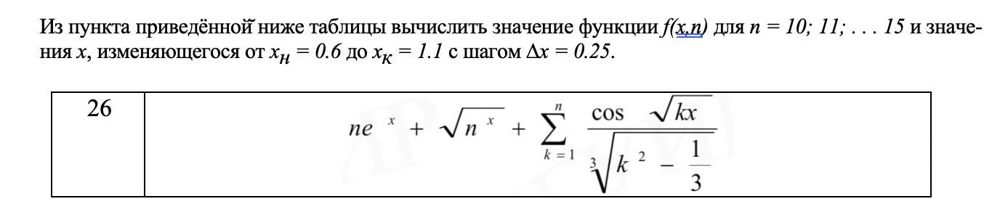

# **Задание 26**
Часть 1:



``` Delphi
program laba2part1;
uses
  System.SysUtils;
var x,f,s: real;
  k: integer;
begin
  x:=0.6;
  f:=0;
    while x<(1.125) do
    begin
     s:=0;
        for k := 1 to 15 do
        begin
           s:=s+(Cos(sqrt(k*x)/exp(ln(sqr(k)-1/3)*(1/3))));
           if k>=10 then
            begin
            f:=s+(k*exp(x))+(exp(ln(k)*(x/2)));
            writeln('n=',k:2,'     x=', x:4:2, '     f=', f:6:2);
            end;
        end;
      x:=x+0.25;
    end;
  readln
end.

```
